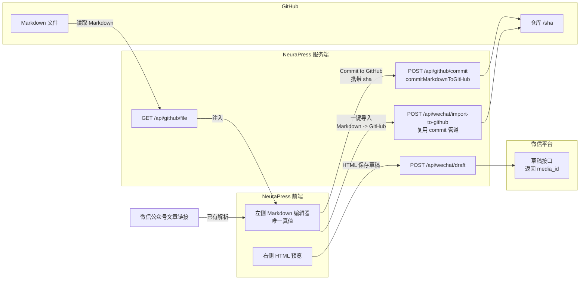

# NeuraPress 外部系统集成方案

## A) 架构与数据流


边界说明：
- 前端仅负责触发动作/展示结果，不直接持有密钥。
- 服务端 `integrations/*` 统一封装 GitHub / 微信 API 调用。
- 外部平台仅暴露 HTTP API，数据通过服务端转发。

## B) 模块划分
- `src/integrations/github.ts`：GitHub I/O 管道（读取、基于 sha 的提交、冲突检测、路径/消息生成）。
- `src/integrations/wechat.ts`：微信草稿管道（HTML -> 草稿、media_id 记录），可注入图片预处理策略。
- `src/app/api/github/file`：获取指定仓库 Markdown 文件，返回 content + sha + path 元信息。
- `src/app/api/github/commit`：接受编辑器 Markdown，调用 `commitMarkdownToGitHub` 完成提交。
- `src/app/api/wechat/draft`：接受预览 HTML，调用微信草稿接口并返回 media_id。
- `src/app/api/wechat/import-to-github`：公众号链接解析出的 Markdown 走同一 commit 管道，自动生成文件路径。
- `src/hooks/useIntegrationActions.ts`：前端动作封装（读取编辑器 state / 预览 HTML，调用对应 API），保持 UI 无集成逻辑。
- `src/types/integration.ts`：跨模块共享的参数与返回类型定义。

## C) API 设计（最小集）
### GET /api/github/file
- **Query**：`owner`(可选，默认 env)、`repo`(可选)、`path`(必填)、`ref`(分支/sha，可选)。
- **Response**：`{ content: string, sha: string, path: string, branch?: string }`。
- **错误**：404 文件不存在；401/403 鉴权失败；500 服务异常。
- **幂等**：纯读取，无副作用。

### POST /api/github/commit
- **Body**：`{ path: string, content: string, message?: string, branch?: string, expectedSha?: string }`。
- **Response**：`{ commitSha: string, fileSha: string, path: string }`。
- **错误**：409 `expectedSha` 与远端不一致；422 缺少参数；401/403 鉴权；500 服务异常。
- **幂等/冲突**：基于 `expectedSha` 进行乐观锁，冲突返回 409 需前端提示重新拉取。

### POST /api/wechat/draft
- **Body**：`{ html: string, title?: string }`。
- **Response**：`{ mediaId: string }`。
- **错误**：400 HTML 为空；401/403 微信鉴权；500 服务异常。
- **幂等**：由微信接口决定，NeuraPress 侧可根据 HTML+title 计算指纹用于幂等键（可选）。

### POST /api/wechat/import-to-github
- **Body**：`{ markdown: string, title?: string, commitMessage?: string, branch?: string }`。
- **Response**：`{ commitSha: string, fileSha: string, path: string }`。
- **错误**：422 markdown 为空；409 sha 冲突；500 服务异常。
- **策略**：按照 `YYYY/MM/DD-title.md` 生成路径（归一化标题），内部调用 `commitMarkdownToGitHub`，与编辑器提交共用管道。

## D) 实现步骤（Phase 化）
### Phase 1：GitHub → NeuraPress（加载）
- **文件**：`src/integrations/github.ts` `src/app/api/github/file/route.ts` `src/hooks/useIntegrationActions.ts`（加载方法）。
- **前端触发**：在工具栏或文件列表入口调用 `loadFromGitHub(path)`，返回 Markdown 注入编辑器 `setValue`，并记录 `sha`/`path` 元数据。
- **伪代码**：
  ```ts
  const file = await fetch(`/api/github/file?path=${encodeURIComponent(path)}`)
  setValue(file.content)
  setMetadata({ path: file.path, sha: file.sha })
  ```

### Phase 2：编辑器 → GitHub Commit
- **文件**：`src/app/api/github/commit/route.ts`；复用 `commitMarkdownToGitHub`。
- **前端按钮**：新增 `Commit to GitHub`，调用 `commitEditorMarkdown()`。
- **伪代码**：
  ```ts
  await commitMarkdownToGitHub({
    path: metadata.path,
    content: editorValue,
    expectedSha: metadata.sha,
    message: customMessage ?? autoMessage(editorValue)
  })
  ```

### Phase 3：微信链接导入 → GitHub
- **文件**：`src/app/api/wechat/import-to-github/route.ts`。
- **前端入口**：在“从公众号链接导入”流程完成 Markdown 解析后，调用 `importWeChatMarkdown(markdown, title)`。
- **伪代码**：
  ```ts
  const path = buildWeChatPath(title)
  await commitMarkdownToGitHub({ path, content: markdown, message: `Import: ${title}` })
  ```

### Phase 4：预览 HTML → 微信草稿
- **文件**：`src/integrations/wechat.ts` `src/app/api/wechat/draft/route.ts`。
- **前端按钮**：新增 `Save as WeChat Draft`，传入当前预览 HTML。
- **伪代码**：
  ```ts
  const html = previewRef.current?.innerHTML
  const { mediaId } = await fetch('/api/wechat/draft', { method: 'POST', body: { html, title } })
  setDraftMetadata(mediaId)
  ```

## E) 风险与边界
- **GitHub sha 冲突**：服务端比对 `expectedSha` 与最新 `sha`，不一致返回 409，前端提示重新加载或执行三方 diff 后再提交。
- **微信 HTML 兼容**：预览 HTML 需做简单白名单过滤（基础标签、行内样式），不支持的标签提前清洗；在服务端追加最小样式内联。
- **图片处理**：
  - GitHub 提交：保留原 Markdown 图片链接；若需要上传，预留 `uploadAssets` 钩子。
  - 微信草稿：检测 ``，可在服务端转存或走微信“永久素材”接口，失败时返回 422。
- **回滚/误操作**：记录最近一次成功 commit 的 `sha` + `path` 于前端状态；提供 “Revert to last pulled” 逻辑，或在 GitHub 侧依赖版本历史回滚。

## F) 最小代码骨架
### GitHub commit service
```ts
// src/integrations/github.ts
export async function commitMarkdownToGitHub({ path, content, message, expectedSha, branch }: CommitInput) {
  const token = getGitHubToken()
  const apiUrl = `https://api.github.com/repos/${owner}/${repo}/contents/${encodeURIComponent(path)}`
  const current = await fetchContentSha(apiUrl, token, branch)
  if (expectedSha && current && expectedSha !== current) throw new ConflictError()
  const res = await fetch(apiUrl, {
    method: 'PUT',
    headers: buildHeaders(token),
    body: JSON.stringify({
      message: message ?? `Update ${path}`,
      content: Buffer.from(content).toString('base64'),
      sha: current ?? expectedSha,
      branch: branch ?? defaultBranch,
    })
  })
  return normalizeCommitResponse(res)
}
```

### 从编辑器 state 读取 Markdown 的示例
```ts
// src/hooks/useIntegrationActions.ts
export function useIntegrationActions({ getMarkdown }: { getMarkdown: () => string }) {
  const commitEditorMarkdown = async (options: { path: string; sha?: string; message?: string }) => {
    const content = getMarkdown()
    const res = await fetch('/api/github/commit', {
      method: 'POST',
      headers: { 'Content-Type': 'application/json' },
      body: JSON.stringify({ ...options, content })
    })
    if (!res.ok) throw new Error('Commit failed')
    return res.json()
  }
  return { commitEditorMarkdown }
}
```

### HTML → 微信草稿的服务端示例
```ts
// src/integrations/wechat.ts
export async function saveHtmlAsDraft(html: string, title?: string) {
  const token = process.env.WECHAT_ACCESS_TOKEN
  if (!html?.trim()) throw new Error('EMPTY_HTML')
  const payload = buildDraftPayload(html, title)
  const res = await fetch(`https://api.weixin.qq.com/cgi-bin/draft/add?access_token=${token}`, {
    method: 'POST',
    headers: { 'Content-Type': 'application/json' },
    body: JSON.stringify(payload)
  })
  const data = await res.json()
  if (data.errcode) throw new Error(data.errmsg)
  return { mediaId: data.media_id as string }
}
```

